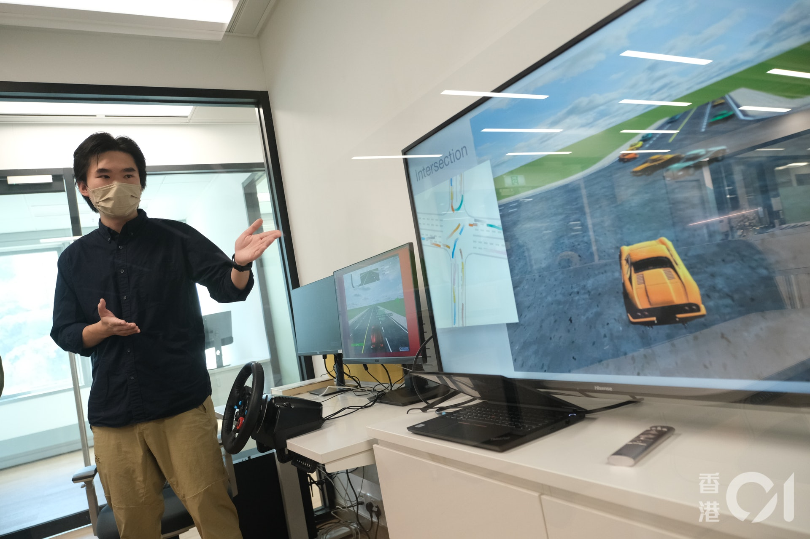

 
## Education

##### The Chinese University of Hong Kong

* August 2019 - Present
* Graduate student at Information Engineering Department.
* Supervised by <a href="http://boleizhou.github.io">Professor Bolei Zhou</a>.

##### Shanghai Jiao Tong University

* September 2015 - July 2019
* Supervised by <a href="http://www.cs.sjtu.edu.cn/~jiangli/">Professor Li Jiang</a> at Advanced Computer Architecture Laboratory.
* Major in Naval Architecture and Ocean Engineering.
* Member of Zhiyuan Honors Program.

##### The Affiliated High School of South China Normal University

* September 2012 - July 2015
* I love my high school!

 
 
## Teaching

##### Awards

* Teaching Assistant Awards, Term 2, 2020-21
* Teaching Assistant Awards, Term 1, 2020-21

##### Teaching Assistance

* IERG5350 Reinforcement Learning at CUHK, Term 1, 2021-22
* CSCI2100E Data Structures at CUHK, Term 2, 2020-21
* IERG5350 Reinforcement Learning at CUHK, Term 1, 2020-21
* Intro to Reinforcement Learning (introRL) at bilibili: Open-source online lectures
* IERG6130 Seminar on Reinforcement Learning at CUHK, Term 2, 2019-20

 
 
## Press Coverage

* A group of journalist visited our Embodied AI lab at CPII On December 6, 2021. The following press make their reports:
[BastillePost 巴士的報](https://www.bastillepost.com/hongkong/article/9756888),
[HK01 香港01](https://www.hk01.com/%E7%A4%BE%E6%9C%83%E6%96%B0%E8%81%9E/708959/%E4%B8%AD%E5%A4%A7innohk%E8%AE%93ai%E8%B7%9F%E4%BA%BA%E9%A1%9E%E5%AD%B8%E9%A7%95%E9%A7%9B%E6%B1%BA%E7%AD%96-%E9%AB%98%E6%95%88%E5%AD%B8%E7%BF%92%E8%AE%93%E7%84%A1%E4%BA%BA%E8%BB%8A100-%E5%AE%89%E5%85%A8%E9%A7%95%E9%A7%9B%0A),
[HK Commercial Daily 香港商報](http://www.hkcd.com/hkcdweb/content/2021/12/07/content_1310287.html),
[South China Morning Post](https://www.scmp.com/news/hong-kong/society/article/3158663/hong-kongs-chinese-university-sets-6-labs-under-umbrella),
[Sing Tao Daily 星島日報](../assets/pdf/press_coverage_2021.pdf),
[HK Economic Journal 信報](../assets/pdf/press_coverage_2021.pdf),
[Ta Kung Pao 大公报](../assets/pdf/press_coverage_2021.pdf).

 
 
## Papers

* Mingxin Huang, Yuliang Liu, <b>Zhenghao Peng</b>, Chongyu Liu, Dahua Lin, Shenggao Zhu, Nicholas Yuan, Kai Ding, and Lianwen Jin. 
Swintextspotter: Scene text spotting via better synergy between text detection and text recognition.
(**CVPR 2022**)

* Quanyi Li\*, <b>Zhenghao Peng\*</b>, and Bolei Zhou.
Efficient Learning of Safe Driving Policy via Human-AI Copilot Optimization.
(**ICLR 2022**) [[Webpage](https://decisionforce.github.io/HACO/)] [[PDF](https://openreview.net/pdf?id=0cgU-BZp2ky)]

* <b>Zhenghao Peng\*</b>, Quanyi Li\*, Chunxiao Liu, and Bolei Zhou.
Safe driving via expert guided policy optimization.
(**CoRL 2021**) [[Webpage](https://decisionforce.github.io/EGPO/)] [[PDF](https://arxiv.org/pdf/2110.06831.pdf)]
 
* <b>Zhenghao Peng</b>, Quanyi Li, Chunxiao Liu, and Bolei Zhou.
Learning to simulate self-driven particles system with coordinated policy optimization.
(**NeurIPS 2021**) [[Webpage](https://decisionforce.github.io/CoPO/)] [[PDF](https://arxiv.org/pdf/2110.13827.pdf)]

* Hao Sun, Ziping Xu, Meng Fang, <b>Zhenghao Peng</b>, Jiadong Guo, Bo Dai, and Bolei Zhou.
Safe exploration by solving early terminated mdp.
(arXiv preprint)
[<a href="https://arxiv.org/pdf/2107.04200.pdf">PDF</a>]

* Quanyi Li\*, <b>Zhenghao Peng\*</b>, Qihang Zhang, Chunxiao Liu, and Bolei Zhou.
Improving the generalization of end-to-end driving through procedural generation. (arXiv preprint)
[<a href="https://arxiv.org/pdf/2012.13681">PDF</a>]

* <b>Zhenghao Peng</b>, Hao Sun, and Bolei Zhou. Non-local policy optimization via
diversity-regularized collaborative exploration. (arXiv preprint)
[<a href="https://arxiv.org/pdf/2006.07781.pdf">PDF</a>]
 
* Hao Sun, <b>Zhenghao Peng</b>, Bo Dai, Jian Guo, Dahua Lin, and Bolei Zhou. Novel policy seeking
with constrained optimization. (arXiv preprint)
[<a href="https://arxiv.org/pdf/2005.10696.pdf">PDF</a>]

* Hao Sun, Jiankai Sun, <b>Zhenghao Peng</b>, Dahua Lin, and Bolei Zhou. Learning with identity and
uniqueness through social constraint. (NeurIPS 2019 Deep RL Workshop)

* Zhuoran Song, Dongyu Ru, Ru Wang, Hongru Huang, <b>Zhenghao Peng</b>, Jing Ke, Xiaoyao Liang, and Li
Jiang. Approximate random dropout. (**DATE 2020**)
[<a href="https://arxiv.org/pdf/1805.08939.pdf">PDF</a>]

* <b>Zhenghao Peng</b>, Xuyang Chen, Chengwen Xu, Naifeng Jing, Xiaoyao Liang, Cewu Lu, and Li Jiang.
Axnet: Approximate computing using an end-to-end trainable neural network. (**ICCAD 2018**)
[<a href="https://arxiv.org/pdf/1807.10458.pdf">PDF</a>]
